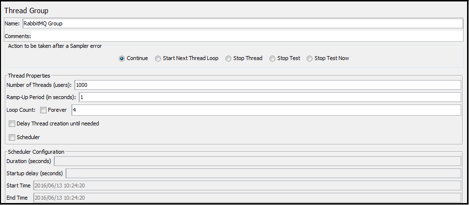
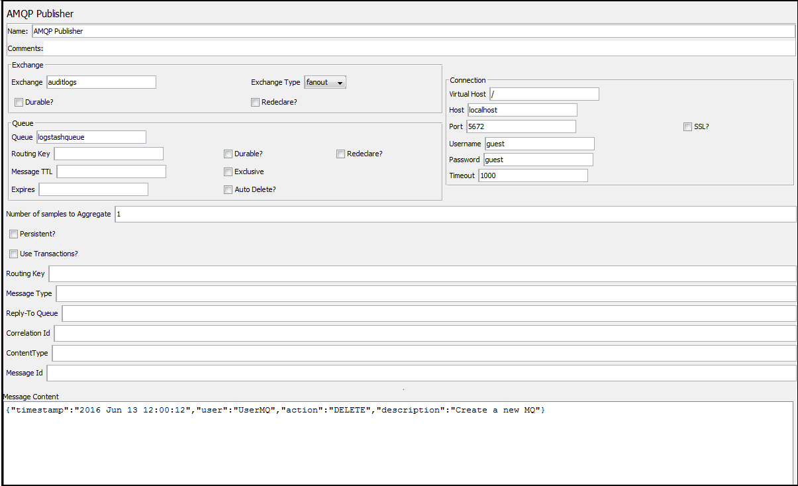
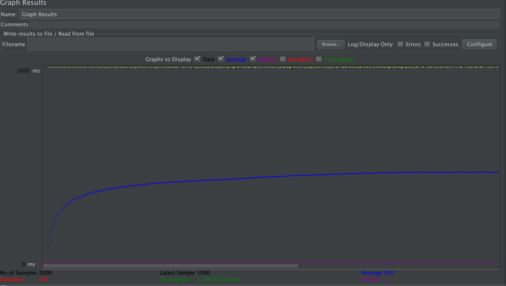
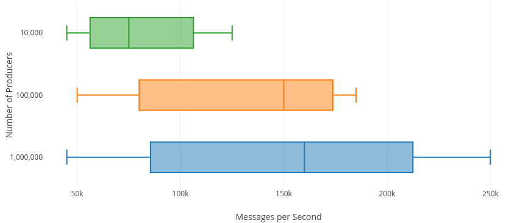

# Implementation Details

Once you have jar with you, place it under jmeter/lib/ext folder. Now open Jmeter and prepare a test plan.

* **Step 1:** To click test plan, right click Test Plan and go to 
`Add`->`Thread(Users)`->`Thread Group`. Give a name to Thread Group:

* **Step 2:**Then right click your group and go to Add->Sampler->AMQP Publisher:

* This congiguration would be repeated for the several iteration of different number of producers.

* When repeated for different number of producers we get the following results

