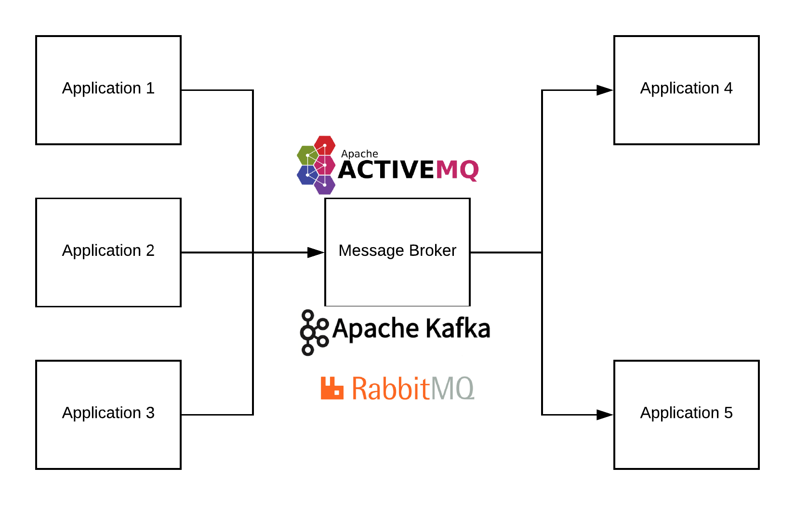
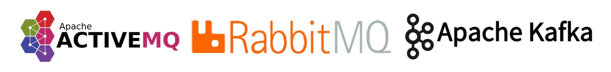
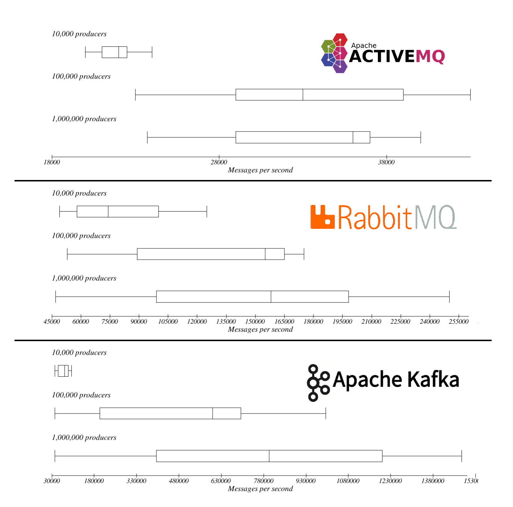
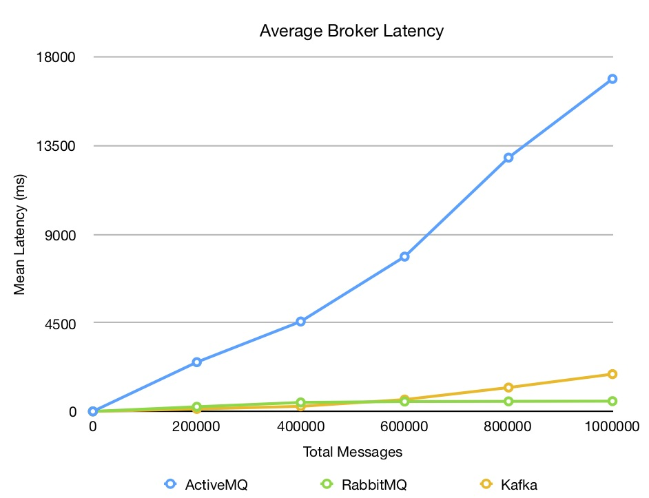
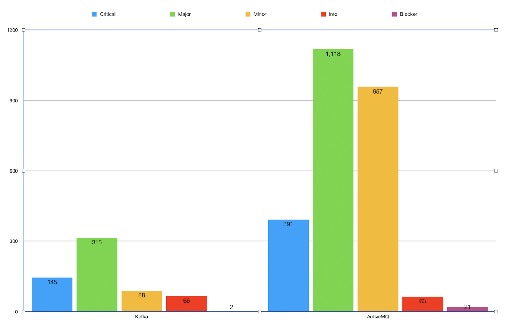
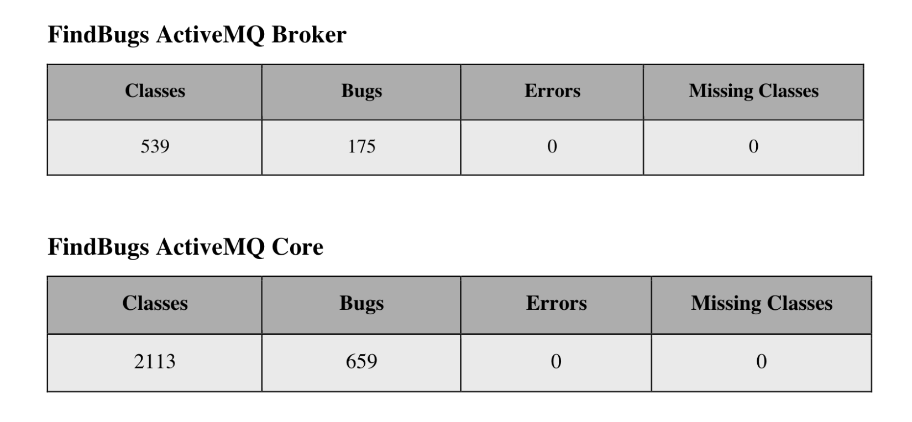
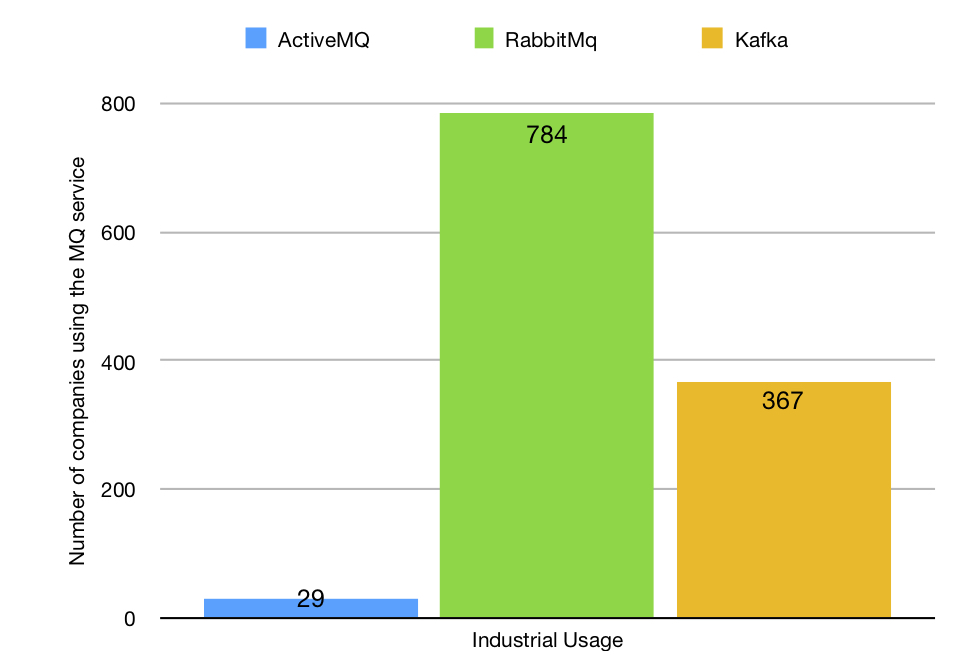
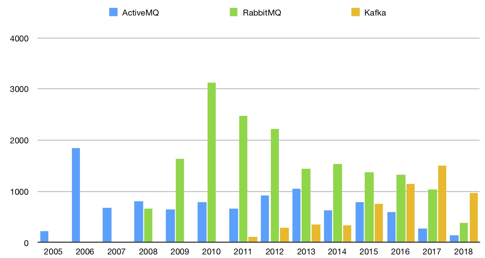
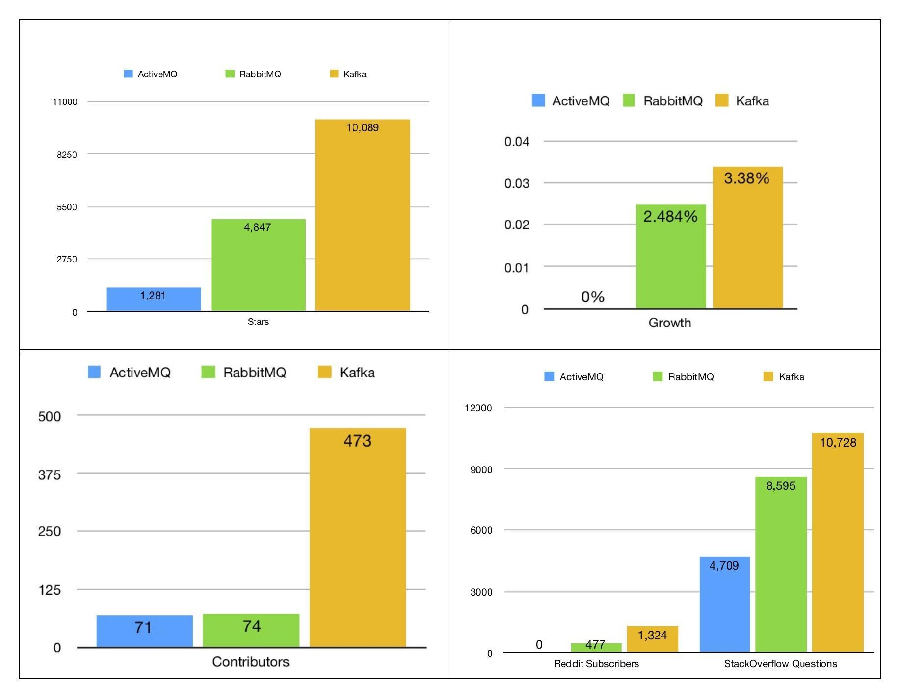

# Message Broker Analysis

### ActiveMQ | RabbitMQ | Kafka

#### CSC 510 - Software Engineering

Team ID - c_uparog

#### Team Members 
* [Arshdeep Singh Syal](https://github.com/ArshdeepSinghSyal) (asyal) {SonarQube}
* [Jubeen Shah ](https://github.com/jubeenshah)(jnshah2) {JMeter Testing + Community Statistics}
* [Rayan Dasoriya](https://github.com/rayandasoriya) (rdasori) {JMeter Testing}
* [Sujal](https://github.com/SujalAhrodia) (ssujal) {Gatling Testing}

### Table of content
1. [Introduction](#Introduction)
2. [Brokers compared](#Brokers-compared)
3. [Resources used](#Resources-used)
4. [Setting up the environment](#setting-up-the-environment)
5. [Implementation Details](#implementation-details)
6. [Results](#results)
	1. [Performance testing](#performance-testing)
	2. [Bugs and errors Inspection](#bugs-and-errors-inspection)
	3. [Community and other Metrics](#Community-and-other-Metrics)
6. [Challenges](#challenges)
6. [Conclusion](#conclusion)
  
### Introduction

Message queueing brokers are the so-called *translators* in the world of computer networks that are responsible for translation of messages from the messaging protocol being used by the `sender` to the messaging protocol being used by the `receiver` and are the building blocks of the message-oriented middleware (MOM). 

### Brokers compared

There are [several message brokers](https://en.wikipedia.org/wiki/Message_broker#List_of_message_broker_software) out there, however we have chosen three out of the bunch. 

* [Apache ActiveMQ](http://activemq.apache.org)
* [Rabbit MQ](http://www.rabbitmq.com)
* [Apache Kafka](https://kafka.apache.org)

### Resources used

* **Performance Testing**
	* [Jmeter](https://jmeter.apache.org)
	* [Gatling](https://gatling.io)
	* [Kafka native performance tools](https://github.com/kafka-dev/kafka/blob/master/bin/kafka-producer-perf-test.sh)
* **Bugs and Errors Inspection**
	* [FindBugs](http://findbugs.sourceforge.net)
	* [SonarQube](https://www.sonarqube.org)
* **Community and other Metrics**
	* [GitHub](https://github.com)
	* [Reddit](https://www.reddit.com)
	* [StackShare](https://stackshare.io/)
	* [Stack overflow](https://stackoverflow.com)
	* [Google Trends](https://trends.google.com/trends/)
	* [Lines of Code](./02-GitHubStats/01-LinesOfCode)

### Setting up the Environment

In this section we briefly outline the steps needed to carry out the installation for the respective message brokers and tools. Clicking on each link would take you to the series of steps (compiled in a .pdf in this repo) that we performed to install them.
* [Apache ActiveMQ](./00-Prerequisites/01-Installation-apacheMQ.pdf)
* [RabbitMQ](./00-Prerequisites/02-Installation-rabbitMQ.pdf)
* [Apache Kafka](./00-Prerequisites/03-Installation-ApacheKafka.pdf)
* [Gatling Installation](https://gatling.io/docs/current/installation/#installation)
* [Gatling Plugins and Extensions](https://gatling.io/docs/2.3/extensions/)
* [Installing the Tools](./00-Prerequisites/04-Installing-Tools.pdf)

### Implementation Details
For specific configuration of the message brokers with JMeter, you can click on the following links to get a detailed description of the steps we followed to setup the producers and consumers with JMeter.
* [ActiveMQ](./01-JMeterTesting/01-ActiveMQ/README.md)
* [RabbitMQ](./01-JMeterTesting/02-RabbitMQ/README.md)
* [Kafka](./01-JMeterTesting/03-Kafka/README.md)

### Results

#### Performance Testing
* Message Throughput Comparision

*  Latency

* RabbitMQ Testing using [johnlonganecker/rabbitmq-performance-app](https://github.com/johnlonganecker/rabbitmq-performance-app) repository

* Kafka testing using [custom scripts](./01-JMeterTesting/03-Kafka/testKafka.sh)
	* You can find the associated [log file results](./master/01-JMeterTesting/03-Kafka/03-19112018/Upto100Mil.txt) and [here](./01-JMeterTesting/03-Kafka/03-13102018/KafkaTestLog.txt)
	* The below image gives is one of the plot for the above log files, the rest of the images can be found [here](./01-JMeterTesting/03-Kafka/Images)

#### Bugs and Errors Inspection
* SonarLint

* FindBugs

#### Community and other Metrics
In this section we briefly outline a few results that we gathered from studying the community as stated in [the `Resources Used` section](#Resources-used), however, the full documentation can be found [here](./04-GitHubStats/%23Documentation-GitHub%20and%20Other%20stats.pdf).
* RabbitMQ is the most popular in the industry, despite Kafka having better performance. 
* This can be because, Kafka was late to the market, and by then rabbitMQ had already taken over the market share from activeMQ
* This can be because a majority of the companies that were previously using ActiveMQ found it very complex. 
* The switching costs associated to rabbitMQ are very low
* It is simple, flexible, and has several tool integrations available

* Based on commits per year for each of the message queuing services, it can be seen that the community for ActiveMQ is becoming less and less active over the years, being the most active in the year 2006, and the least active being this year (2018), which could be correlated with the decline in popularity of the broker amongst developers and organizations alike.
* RabbitMQ’s community seemed to be the most active during the years 2009 through 2016. After which it was swiftly taken over by Kafka.
* It is interesting to know that the number of commits per year for Kafka increased at an average rate of **61%** from `2011 to 2017`
* For the same period, RabbitMQ had a growth rate **-12%**, with activeMQ having a growth rate of **-6%**.
* These results further concretely help us understand the reason for growing popularity amongst developers and organizations and their tendency of moving towards Kafka, thereby resulting in a slightly higher growth rate in adoption.

* Looking at the google internet search for the topics directly related to RabbitMQ, Kafka, and ActiveMQ it can clearly be seen that In the past year, the most popular message queueing service has been Kafka.
* This fact can be further supported by the fact that Kafka has the highest number of stars (amongst the three) on Github, translating to very high preference amongst developers.
* This statistic is important to know, as it can help us with the growth trend towards a particular message queuing broker, which should be higher for Kafka, given its increased popularity amongst developers. 
* For example, a comparison is made between the industrial usage of the message queuing broker, as it was in the beginning of the semester and as it can be seen in the image below.
* As hypothesized, the growth in the number of companies using Kafka has **1%** more increase than in RabbitMQ. This has resulted in more tools being developed for the integration with Kafka.

### Challenges
* According to our understanding, gatling was not able to find the `ClockSingleton` class in current release of Kafka server. We have raised the same issue on github repository of the plugin we were trying to implement but haven’t been able to resolve it yet. Moreover, one possible way of implementing both the servers could be hosting an API on the servers and then exposing them using gatling to test, which we did not implement due to time constraints.
* The extension was built on `gatling 2.2` and the current version is `3.0` series. Moreover, the Apache Kafka server needed for the plugin to build is `0.10`. We were able to start the latest `2.12` release of kafka. Same was the case with RabbitMQ
* The version compatibility between SBT, Java, Scala and the producer API was extremely tedious and it was quite cumbersome. 

### Conclusion
RabbitMQ is currently the most favored amongst the industry, but there is a shift in affinity towards Kafka, both from the perspective of developers and the industry adoption. The rate at which Kafka is growing is much higher than RabbitMQ, which in contrast seems to be slowly declining its growth rate. ActiveMQ is the least favored from both the developers and industrial perspective given the low industry adoption and developers retention rate. So, if a new developer wishes to contribute to a community, we would recommend contributing to the Kafka community, because of its high rate of activity, retention, support and overall clarity in the documentation. If however, a developer wants to start learning about message brokers, Message Oriented Middleware, and its implementation we personally found ActiveMQ to be a good starting point and then transitioning towards Kafka. RabbitMQ would require a higher learning curve if the developer is unfamiliar with Erlang.

Talking about the performance, Apache Kafka gave the best performance with a very high throughput and a low latency rate. ActiveMQ is preferred over Kafka when traditional enterprise messaging is taken into consideration, however, RabbitMQ does a much better job at throughput, latency and overall community support than ActiveMQ. Kafka, because of its low latency, and very high throughput, fault-tolerance, and its highly distributed architecture is most useful in stream processing, event sourcing, commit log and log aggregation, and traditional messaging. RabbitMQ would be more useful in pub-sub messaging, request-response messaging, and also act as an underlaying layer for IoT applications. Hence, depending on the specific use-case you can choose either RabbitMQ or Kafka
